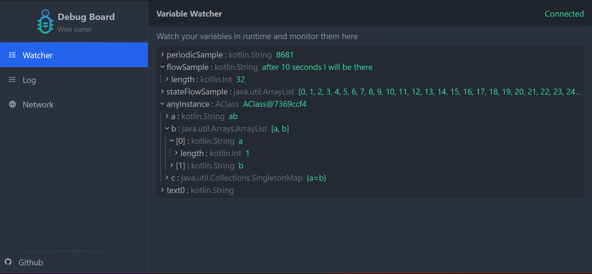

<p align="center" style="text-align:center">

<h1 align="center" style="text-align:center">Debug Board</h1>
</p>
<p align="center" style="text-align:center">
Runtime debug utilities for kotlin that has panel for both IDE and Web
<br><br>
<a href="https://jitpack.io/#amir1376/debugboard">

</a>
</p>

-------

## Features

- Watch variables when your app is running
- Inspect network request/response
- Show logs
- Has a [Plugin](https://plugins.jetbrains.com/plugin/21331-debug-board) for IntelliJ Idea / Android Studio
- Or Directly in your browser

## Setup

### Dependency

Add to your gradle build script file

```kotlin 
//build.gradle.kts

repositories {
    //...
    maven("https://jitpack.io")
}

dependencies {
    //...
    val version = "x.y.z" //see the last version above
    //core library
    debugImplementation("com.github.amir1376.debugboard:core:$version")
    releaseImplementation("com.github.amir1376.debugboard:core-no-op:$version")
    
    //backend (for Web Panel / IntelliJ Plugin)
    debugImplementation("com.github.amir1376.debugboard:backend:$version")
    releaseImplementation("com.github.amir1376.debugboard:backend-no-op:$version")
    //optional integrations
    //add one of these integrations for network inspection
    debugImplementation("com.github.amir1376.debugboard:ktor:$version")
    releaseImplementation("com.github.amir1376.debugboard:ktor-no-op:$version")
    debugImplementation("com.github.amir1376.debugboard:okhttp:$version")
    releaseImplementation("com.github.amir1376.debugboard:okhttp-no-op:$version")
    // integration for android timber library
    debugImplementation("com.github.amir1376.debugboard:timber:$version")
    releaseImplementation("com.github.amir1376.debugboard:timber-no-op:$version")
    // integration for jetpack compose library 
    debugImplementation("com.github.amir1376.debugboard:compose:$version")
    releaseImplementation("com.github.amir1376.debugboard:compose-no-op:$version")
}
```

<details>
<summary>What is that no-op postfix after module names?</summary>
It is the "No Operation" version of that module. It removes all functionalities that DebugBoard uses during development 
which reduces release output size
You can use it in your release variants
</details>

## Usage

Start embedded Web Server to access the (Web/Plugin) Panel

```kotlin
DebugBoardBackend().startWithDefaultServer()
```

> Server listens on port 8000 by default

> If you are using plugin use `ws://` instead of `http://` in address box for access the panel

> Server address will be logged in `STDOUT` too

<details>
<summary>Note for android users</summary>

Make sure you have declared `Internet permission` in your application's `AndroidManifest.xml`

```xml

<uses-permission android:name="android.permission.INTERNET"/>
```

otherwise android does not allow you to create server

</details>

### Watch a variable



To watch a variable you have to passed it into addWatch

your variable must be an observable or somehow notify library about its update
here I use a StateFlow

```kotlin
val stateFlow = MutableStateFlow("bla bla")
val removeWatch = addWatch("specifyName", stateFlow) 
```

Now when `stateFlow` changes you will be notified in Web Panel

```kotlin
stateFlow.value = "ha ha"  
```

And after you don't want to watch this anymore
call returned function from the addWatch() to remove from watchlist

```kotlin
removeWatch()
```

### Network inspection


Add one of network library integrations to your project dependencies

- #### [Ktor client](https://github.com/ktorio/ktor)

```kotlin
HttpClient {
    //...
    install(KtorDebugBoard)
}
```

- #### [Okhttp client](https://github.com/square/okhttp)

```kotlin
OkHttpClient
    .Builder()
    //...
    .addInterceptor(OkHttpDebugBoardInterceptor())
    .build()
```

Now all your request and response will be available in the Web Panel

### Log

You can send some logs to the log panel here is an example

```kotlin
DebugBoard.Default.logger.log(
    LogData(
        LogLevel.Debug,
        "TAG",
        "my message"
    )
)
```

#### Jetpack Compose

You can use AddWatch composable function
to watch a variable inside a composition scope
it will be automatically removed after Composable exits from the screen

```kotlin
@Composable
fun MyPage() {
    val myUiState = rememberSomeUiState()
    AddWatch("MyPageState", myUiState)
}
```

#### Timber

If you use [timber library](https://github.com/JakeWharton/timber) you can plant `DebugBoardTree` to add your log data
into the Web Panel
in your Application class initial `timber` with

```kotlin
Timber.plant(
    DebugBoardTree(),
    Timber.DebugTree()
)
```

## Todos

1. [X] Add jetpack compose integration and utilities
2. [X] Improve ktor plugin to handle errors
3. [X] Add some screenshots from the Web Panel
4. [X] Improve log and add filter in Web Panel
5. [X] Add Intellij Idea Plugin
5. [X] Add "No Operation" version of each module
6. [ ] Add database into panel
